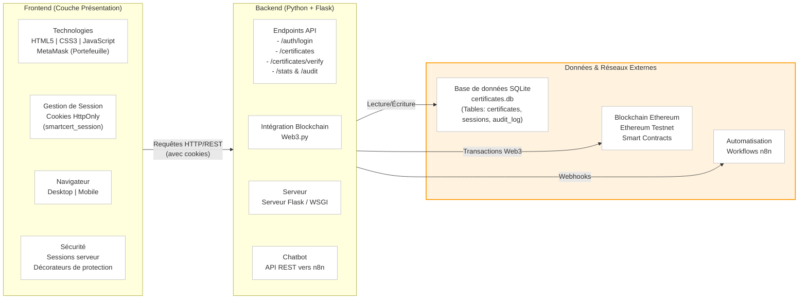

# Environnement & Architecture Technique - SmartCert

Ce document décrit l'architecture technique du projet **SmartCert**, en remplacement de l'ancienne architecture (PHP/JSON/APIs Islamiques) pour correspondre à la branche principale actuelle (Flask/SQLite/Blockchain).

## Diagramme d'Architecture (Mermaid)

## Résumé des modifications par rapport à l'image fournie

### 1. Bloc "Frontend"
*   **Technologies :** Conservation de HTML5, CSS3, et JavaScript. Ajout de **MetaMask** qui est essentiel pour interagir avec la blockchain.
*   **Session :** Remplacement de `localStorage` par des **Cookies HttpOnly** (`smartcert_session`), comme défini dans votre README, ce qui est plus sécurisé car non accessible via JavaScript.
*   **Sécurité :** Remplacement des mentions Bcrypt/Anti-injection par les méthodes utilisées dans votre projet : **Sessions côté serveur**, hashage avec **Werkzeug (PBKDF2-SHA256)**, et les **Décorateurs Flask** (`@login_required`, `@role_required`).

### 2. Bloc "Backend"
*   **Serveur :** Remplacement de `Apache + PHP` par **Python + Flask**.
*   **Modules :** Remplacement des modules (signup, forgot-pass...) par les routes réelles de l'application : **`/auth/login`**, **`/certificates`**, **`/verify`**, **`/stats`**, **`/audit`**.
*   **Ajouts :** Intégration de **Web3.py** pour faire le lien entre le backend et la blockchain, et l'API de communication avec **n8n**.

### 3. Bloc "Données (Stockage)"
*   **Base de données locale :** Remplacement des `Fichiers JSON` par **SQLite** (`certificates.db` contenant les tables `certificates`, `audit_log`, `sessions`).
*   **APIs Externes :** Remplacement des APIs (Coran, Prière, Hadiths) par :
    *   **Ethereum Testnet** pour l'enregistrement et la vérification des certificats sur la blockchain.
    *   **Workflows n8n** pour la logique du chatbot d'assistance.
