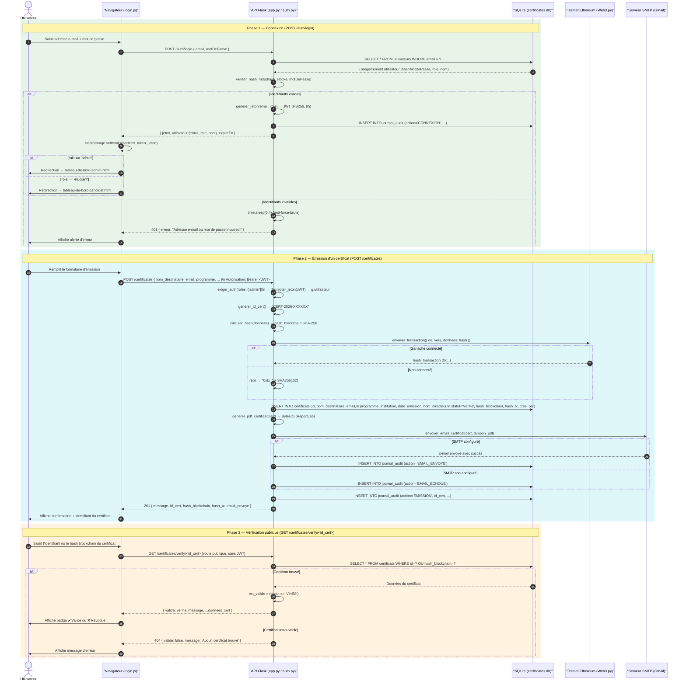
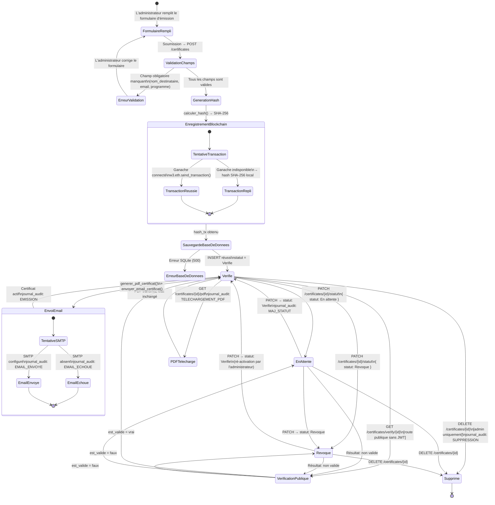

# SmartCert — Diagrammes UML (Version Française)

> Tous les diagrammes sont dérivés directement du code source de la branche principale (`app.py`, `auth.py`, `cert_services.py`, `login.js`).

---

## 1. Diagramme de Séquence — Authentification & Émission de Certificat

Ce diagramme couvre trois scénarios : la connexion d'un utilisateur, l'émission d'un certificat avec enregistrement blockchain et envoi automatique d'e-mail, puis la vérification publique.



---

## 2. Diagramme de Classes — Architecture du Système

Ce diagramme représente tous les modules Python, les tables SQLite, le client blockchain et le frontend JavaScript avec leurs responsabilités et leurs relations.

```mermaid
classDiagram
    direction LR

    class ApplicationFlask {
        +application: Flask
        +clientWeb3: Web3
        +CHEMIN_BDD: str
        +FOURNISSEUR_WEB3: str
        +obtenir_bdd() Connexion
        +initialiser_bdd() vide
        +generer_id_certificat() str
        +calculer_hash(donnees) str
        +enregistrer_blockchain(hash) str
        +journaliser_action(action, id_cert, details) vide
        +ligne_vers_dict(ligne) dict
    }

    class BlueprintAuthentification {
        +SECRET_JWT: str
        +ALGO_JWT: str = "HS256"
        +DUREE_JWT_H: int = 8
        +CHEMIN_BDD: str
        +obtenir_utilisateur_par_email(email) dict
        +generer_jeton(email, role) str
        +decrypter_jeton(jeton) dict
        +extraire_jeton() str
        +exiger_auth(roles) Decorateur
        +journaliser_auth(action, email, role, ip) vide
    }

    class RoutesCertificats {
        <<Routes Flask - Certificats>>
        +POST /certificates [admin]
        +GET /certificates [authentifie]
        +GET /certificates-{id} [authentifie]
        +DELETE /certificates-{id} [admin]
        +PATCH /certificates-{id}-statut [admin]
        +GET /certificates-verify-{id} [public]
        +GET /certificates-{id}-pdf [authentifie]
        +POST /certificates-{id}-envoyer-email [admin]
    }

    class RoutesAuthentification {
        <<Blueprint /auth>>
        +POST /auth/inscrire
        +POST /auth/connexion
        +POST /auth/deconnexion [authentifie]
        +GET /auth/moi [authentifie]
        +GET /auth/verifier-jeton
        +GET /auth/sessions [admin]
    }

    class RoutesStatistiques {
        <<Routes Flask - Stats et Audit>>
        +GET /stats [authentifie]
        +GET /audit [admin]
        +GET /chaine/statut [authentifie]
    }

    class ServicesCertificats {
        +HOTE_SMTP: str
        +PORT_SMTP: int
        +UTILISATEUR_SMTP: str
        +MOT_DE_PASSE_SMTP: str
        +generer_pdf_certificat(cert) BytesIO
        +envoyer_email_certificat(cert, pdf) bool
        -html_email(cert) str
        -chemin_logo() str
    }

    class Certificat {
        <<Table SQLite : certificates>>
        +id: TEXTE CleP
        +nom_destinataire: TEXTE
        +email: TEXTE
        +programme: TEXTE
        +institution: TEXTE
        +date_emission: TEXTE
        +nom_directeur: TEXTE
        +statut: TEXTE
        +hash_blockchain: TEXTE
        +hash_tx: TEXTE
        +cree_par: TEXTE
        +cree_le: TEXTE
    }

    class Utilisateur {
        <<Table SQLite : users>>
        +id: ENTIER CleP
        +email: TEXTE UNIQUE
        +hash_mdp: TEXTE
        +role: TEXTE
        +nom: TEXTE
        +cree_le: TEXTE
    }

    class JournalAudit {
        <<Table SQLite : audit_log>>
        +id_log: ENTIER CleP
        +action: TEXTE
        +id_cert: TEXTE
        +realise_par: TEXTE
        +horodatage: TEXTE
        +details: TEXTE
    }

    class ClientBlockchain {
        <<Externe : Ganache / Ethereum>>
        +est_connecte() bool
        +eth.comptes: liste
        +eth.envoyer_transaction(tx) octets
    }

    class InterfaceLoginJS {
        <<JavaScript : login.js>>
        +roleActuel: chaine
        +changerRole(role) vide
        +seConnecter() async vide
        +sInscrire() async vide
        +afficherAlerte(id, msg) vide
        +afficherMentionsLegales(type) vide
    }

    ApplicationFlask --> RoutesCertificats : definit
    ApplicationFlask --> RoutesStatistiques : definit
    ApplicationFlask --> BlueprintAuthentification : register_blueprint()
    BlueprintAuthentification --> RoutesAuthentification : definit
    ApplicationFlask --> ServicesCertificats : importe
    ApplicationFlask --> ClientBlockchain : utilise via Web3.py
    RoutesCertificats --> Certificat : CRUD SQLite
    RoutesCertificats --> JournalAudit : INSERT
    BlueprintAuthentification --> Utilisateur : SELECT et INSERT
    BlueprintAuthentification --> JournalAudit : INSERT connexion/deconnexion
    ServicesCertificats --> Certificat : lit les champs
    InterfaceLoginJS --> RoutesAuthentification : fetch() HTTP
    InterfaceLoginJS --> RoutesCertificats : fetch() HTTP
```

---

## 3. Diagramme d'États — Cycle de Vie d'un Certificat

Ce diagramme modélise tous les états possibles d'un objet `Certificat` depuis sa création jusqu'à sa suppression définitive, avec les transitions déclenchées par les actions administrateur, la blockchain et le système d'e-mail.



---

## Correspondance Code Source → Diagrammes

| Élément UML | Fichier source | Fonction / Méthode |
|---|---|---|
| Flux connexion | `auth.py` | `login()` + `generer_jeton()` |
| Décorateur d'authentification | `auth.py` | `exiger_auth()` |
| Flux émission | `app.py` | `emettre_certificat()` |
| Calcul de hash | `app.py` | `calculer_hash()` + `hashlib.sha256` |
| Enregistrement blockchain | `app.py` | `enregistrer_blockchain()` + `w3.eth.send_transaction()` |
| Génération PDF | `cert_services.py` | `generer_pdf_certificat()` via ReportLab |
| Envoi e-mail | `cert_services.py` | `envoyer_email_certificat()` via smtplib |
| États `Vérifié / En attente / Révoqué` | `app.py` | `mettre_a_jour_statut()` + liste `autorisés` |
| Insertions journal d'audit | `app.py` + `auth.py` | `journaliser_action()` + `journaliser_auth()` |
| Requêtes HTTP frontend | `frontend/login.js` | `seConnecter()` + `sInscrire()` |
