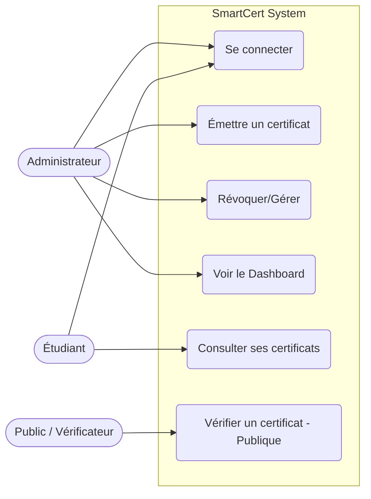

<!-- use this link to generate the diagram: https://mermaid.ai/app/dashboard or use a local mermaid live editor to visualize the diagram. Make sure to copy the entire code snippet below and paste it into the editor to see the use case diagram for the SmartCert System. -->
